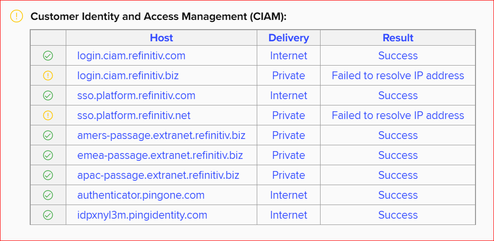

## ✔️ Refinitiv Workspace for Datastream, Eikon and Thomson One 

> 대표적인 글로벌 데이터 수집 공유 플랫폼인, `Refinitiv(구 Reuters)사의 Workspace(구 Datastream 통합) 사용을 위한 튜토리얼`입니다.
>
> 본 가이드는 `권한이 부여된 아이디와 비밀번호를 보유한 분들께 적용`되며 `월 제한된 용량의 데이터를 장소 제약없이 사용 가능`합니다.
>
> `무제한 다운로드`는 `인천대학교 중앙도서관 2층 연속간행물실`의 가이드를 받아 사용 가능합니다.

---

> 모든 데이터는 `교육용/연구용/개별프로젝트용`으로 사용 `가능`하나 `인턴이나 고용이 발생`되는 비즈니스적 사용은 `불가능`합니다.
>
> 

---

## :gift: Request for a New Account
- **신청:** 아래 `관리자`에게 `인천대 메일`로 `신청요청 메일 전달`
- `인천대학교 이메일` 주소를 기반으로만 생성 가능
- `신규ID` 발급에 2~3일 정도 소요 가능하며 완료시 `생성완료 메일` 수령

---

## :open_file_folder: Installation 

### 1) System Test Tool
- 
- `기기 또는 웹상` 중 어디에서 테스트 할지 선택 후 맞는 파일을 다운로드 및 설치
- `다운로드 파일 실행 후`, 아래 사진처럼 `CIAM 부분 중 Internet 부분 모두 Pass 확인`
> 

### 2) Workspace Download
- 
- 사용 `기기(PC, Mobile 지원)의 운영체제(Windows, macOS, iOS, Android지원)에` 맞는 파일을 다운로드 및 설치

---

## :book: Learning Centre 

### 1) Live Training
- Workspace `기본적인 사용법과 데이터 추출 예시 등`을 제공
- `실시간`으로 열리는 다양한 수업에 참여하여 `질문 및 피드백을 즉각적`으로 받을 수 있음
- Workspace for Students 예시: `Enrol in classes 아래` -> `Available classes 클릭` -> `왼쪽 Filters Product 드롭다운` -> `Refinitiv Workspace for Students 선택` -> `원하는 클래스 제목 클릭` -> `아래 Schedules Classes에서 Time zone 선택` -> `Enrol 클릭` -> `신청자 정보 입력 후 하단 Enrol in class 클릭` -> `등록이 완료되면 확인 이메일 수령`

### 2) On-demand Training
- Workspace `기본적인 사용법과 데이터 추출 예시 등`의 기존 녹화된 영상을 제공
- `질문 및 피드백`과정이 없지만 `등록과정이 불필요`하고 `빠르게 지식 습득` 가능
- Workspace for Students 예시: `Watch videos 아래` -> `Watch videos 클릭` -> `왼쪽 Filters Product 드롭다운` -> `Refinitiv Workspace for Students 선택` -> `원하는 클래스 제목 클릭` -> `신청자 정보 입력 후 하단 Watch now 클릭` -> `바로 시청 가능`
- **정보 입력 오류 시 일부내용 Open Training 이용:** 

---

## :sweat: Help Desk
- Workspace 관련 `기술적인 장애` 또는 `데이터 문의`
- **접근:** `Refinitiv Workspace` -> `우측 상단 Help 아이콘 클릭` -> `Get Help & Support 클릭`

| **종류** | **방식** |
|:---|:---|
| `Live Chat` | `1:1 라이브 채팅`을 통해 지원 가능 |
| `Create a Support Case` | 문의내용을 남기면 `헬프데스크에서 이메일로 답변` |
| `Call Us` -> `Location 드롭다운` -> `South Korea` | `오전8시~오후6시` 한국어 서비스 지원되며, 그 외 시간은 영어로 지원 |

---

## :guardsman: USER License Management

- **관리자:** `김경원 교수`    
- **이메일:**  
- `시크릿 모드 브라우저`에서 `EAS(Eikon Administration Services)`를 접속하여 `관리자만` License Management탭 에서 `생성/관리` 가능
- **접근 페이지1:**  -> `좌측 Products` -> `User Administration` -> `Eikon License Management`
- **접근 페이지2:** 
- **사용자 ID 생성/관리 방법:** 
- 현재 특수 상황을 고려하여 `김경원 교수`가 관리자지만, 향후 개인정보 이슈에 안전하도록 `공공 관리자`에게 `모든 권한과 데이터 전달 예정`
